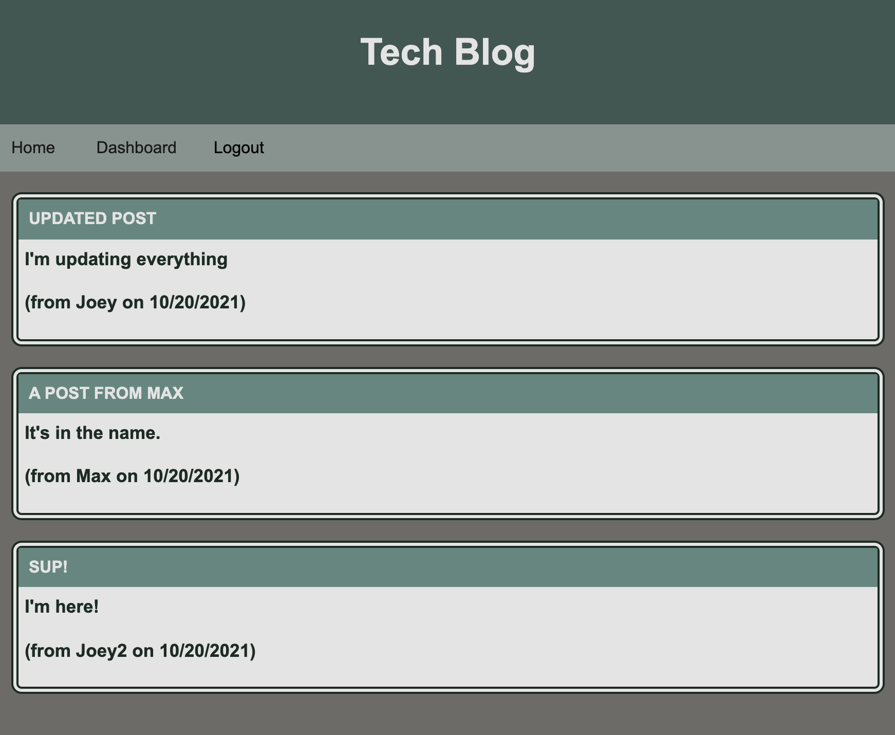
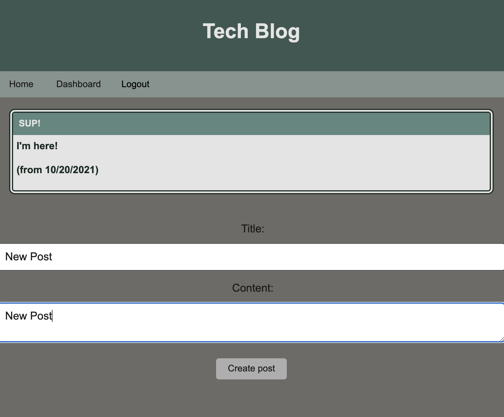
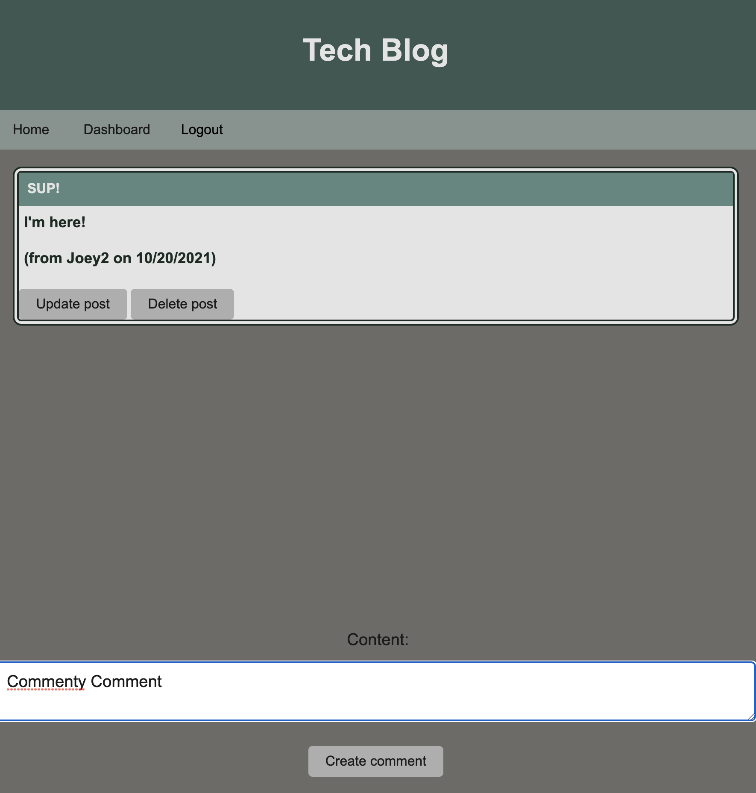

# tech-blog

## Description
This is a tech blog. You can create an account, add posts, update and delete posts, and add comments to posts.  

## Table of Contents 
- [Installation](#installation)
- [Usage](#usage)
- [License](#license)
- [Contributing](#contributing)
- [Tests](#tests)
- [Questions](#questions)

## Installation
You can install the project here: https://github.com/jfisher37/tech-blog

## Usage
To use this project, create an account, and add posts and comments as you choose. You can access the project here:

https://infinite-spire-15099.herokuapp.com/

You can see the photos below for reference. 

Homepage:

Dashboard:
   
   

A page for a post:
   
   

Login page:
   
   

## License
This project is covered by a MIT license.

## Contributing
If you want to make contributions, please refer to the following instructions:

If you'd like to contribute, please reach out in accordance with the contact information in the Questions section below.

## Tests
If you'd like to test the project, please reach out in accordance with the contact information in the Questions section below.

## Questions
Please refer to the below contact information for any questions:

Github Profile - jfisher37

Github Profile Link - https://github.com/jfisher37

Email - joseph.eric.fisher@gmail.com

